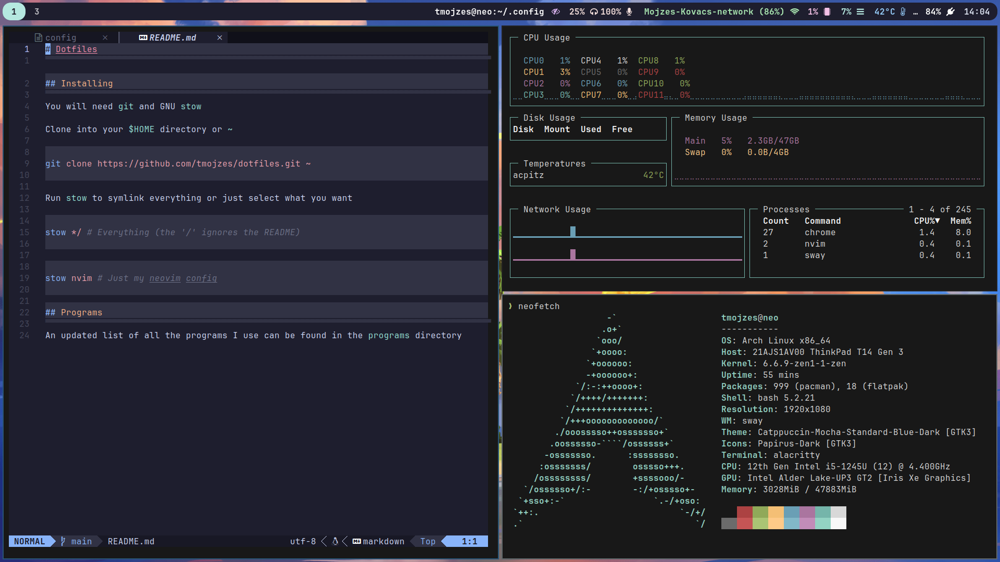

# Dotfiles



## Installing

You will need `git` and GNU `stow`

Clone into your `$HOME` directory or `~`

```bash
git clone https://github.com/tmojzes/dotfiles.git ~
```

Run `stow` to symlink everything or just select what you want

```bash
stow */ # Everything (the '/' ignores the README)
```

```bash
stow nvim # Just my neovim config
```

## Dev environment (Nix)

Dev tools (languages, editors, linters, git/CLI utilities, AI CLIs, k8s/infra tooling) are
managed by home-manager via the `nix` package. A few stay on brew on purpose: rustup, pipx,
poetry, odin, and anything not packaged in nixpkgs.

1. Install [Determinate Nix](https://determinate.systems/nix/):

   ```bash
   curl --proto '=https' --tlsv1.2 -sSf -L https://install.determinate.systems/nix | sh -s -- install
   ```

2. Stow the config and activate it (Linux uses `tmojzes`, macOS uses `tmojzes-mac`):

   ```bash
   stow nix
   nix run home-manager/master -- switch --flake ~/.config/home-manager#tmojzes-mac # macOS
   nix run home-manager/master -- switch --flake ~/.config/home-manager            # Linux
   ```

After the first activation, use `home-manager switch` instead of `nix run ...`.

## Programs

An updated list of all the programs I use can be found in the `programs` directory
